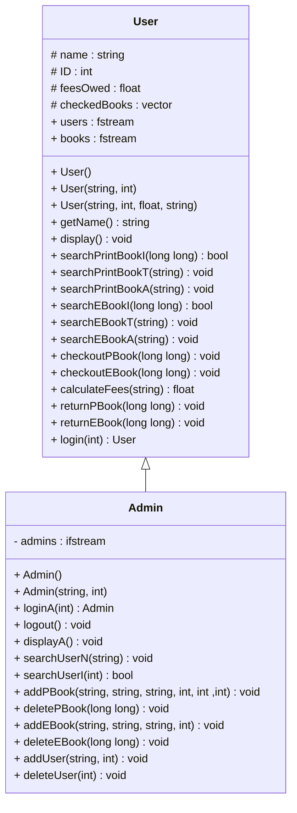
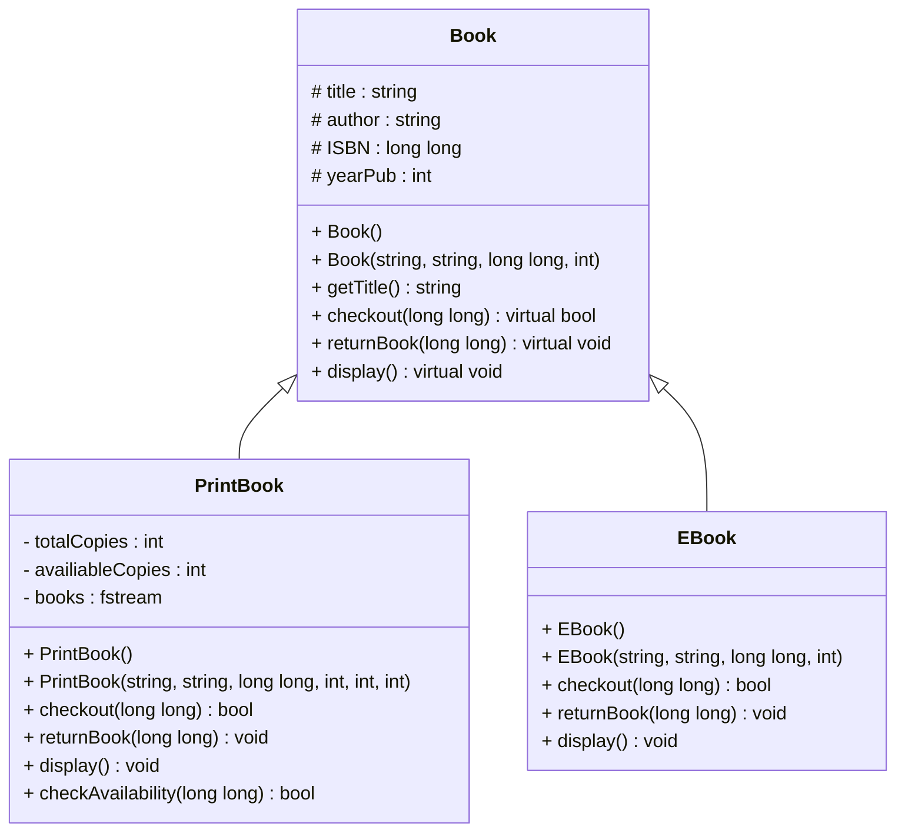

# Project - Library - Brooke Picard
User Functions:
- Display user info
- Search for book
- Checkout book
- Return book

Admin Function:
- Display user info
- Search for book
- Search for user
- Add book
- Delete book
- Add user
- Delete user

## Classes

### User Class
- Constructors
  - `User()`: initialize member variables to defualt values
  - `User(string, int)`: initialize member variables to given parameter
  - `User(string, int, float, string)`: initialize member variables to given parameter
- Getters/Setters
  - `string getName()`: returns name, used to check if class object is empty
- Other Functions
  - `void display()`: displays information of user currently logged in
  - `bool searchPrintBookI(long long)`: searches books.txt for printed book isbn that matches passed isbn, returns true if found
  - `void searchPrintBookT(std::string)`: searches books.txt for printed book title that matches or contains passed string
  - `void searchPrintBookA(std::string)`: searches books.txt for printed book author that matches or contains passed string
  - `bool searchEBookI(long long)`: searches books.txt for ebook isbn that matches passed isbn, returns true if found
  - `void searchEBookT(std::string)`: searches books.txt for ebook title that matches or contains passed string
  - `void searchEBookA(std::string)`: searches books.txt for ebook author that matches or contains passed string
  - `void checkoutPBook(long long)`: checks printed book with matching isbn has availavle copies with  `checkAvailability(long long)`.  Inputs book's isbn under current logged in user in next available book slot.  Asks for current date and saves it in corresponding date slot.  If all slots are filled outputs `"Cannot checkout more than 5 books"`
  - `void checkoutEBook(long long)`: Inputs book's isbn under current logged in user in next available book slot.  Asks for current date and saves it in corresponding date slot.  If all slots are filled outputs `"Cannot checkout more than 5 books"`
  - `float calculateFees(std::string)`: Asks for current date (return date) and checkoutDate is passed as parameter then both dates are converted to days.  daysPassed is calculated by subtracting checkoutDateInDays from returnDateInDays.  14 is subtracted from days passed for grace period.  If daysPass is less than or equal to 0 no fees are added, otherwise $10 is added to fees as well as $5 for each week after - including partial weeks.  Returns fees calculated
  - `void returnPBook(long long)`: Finds printed book with matching isbn (passed as parameter), if found resets book slot to 0s and date to 0s.  Calls `calculateFees(string)` and adds to current user's feesOwed.  Outputs `"Book could not be returned/found"` if book could not be found
  - `void returnEBook(long long)`: Finds ebook with matching isbn (passed as parameter), if found resets book slot to 0s and date to 0s.  Calls `calculateFees(string)` and adds to current user's feesOwed.  Outputs `"Book could not be returned/found"` if book could not be found
  - `User login(int)`: finds user with matching id passed as parameter then reads data from users.txt and creates a new User object and returns.  If user is not found nullUser is created with no variables

### Admin Class
- Constructors
  - `Admin()`: calls default constructor of User
  - `Admin(string, int)`: calls parameterized constructor of user
- Other Functions
  - `Admin loginA(int)`: finds admin with matching id passed as parameter then reads data from admins.txt and creates a new Admin object and returns.  If admin is not found nullAdmin is created with no variables
  - `void logout()`: closes admins.txt
  - `void displayA() const`: displays information of admin currently logged in 
  - `void searchUserN(std::string)`: searches users.txt for user's name that matches or contains passed string
  - `bool searchUserI(int)`: searches users.txt for user's id that matches passed int
  - `void addPBook(std::string, std::string, std::string, int, int, int)`: Takes in title, author, isbn, year published, total copies, and avaliable copies of new printed book.  Makes sure book does not already exist before adding information to books.txt
  - `void deletePBook(long long)`:  Takes in printed book isbn and finds book in books.txt then turns information to * to block it out
  - `void addEBook(std::string, std::string, std::string, int)`: Takes in title,author, isbn, and year published of new Ebook.  Makes sure book does not already exist before adding information to books.txt
  - `void deleteEBook(long long)`: Takes in Ebook isbn and finds book in books.txt then turns information to * to block it out
  - `void addUser(std::string, int)`:  Takes in name and id number of new user.  Makes sure user does not already exist before adding it to users.txt
  - `void deleteUser(int)`:  Takes in id and finds user in users.txt then turns information to * to block it out


### UML


### Book
- Constructors
  - `Book()`: initialize member variables to default parameter
  - `Book(string, string, long long, int)`: intiialize member variables to given parameters
- Getters/Setters
  - `string getTitle() const`: return title, used to see if book is empty
- Other Function
  - `virtual bool checkout(long long)`: pure virtual function, overwritten in child classes
  - `virtual void returnBook(long long)`: pure virtual function, overwritten in child classes
  - `virtual void display()`: pure virtual function, overwritten in child classes

### PrintBook
- Constructors
  - `PrintBook()`: calls default constructor of Book
  - `PrintBook(string, string, long long, int, int, int)`: calls paramatized constructor of Book and initializes additional member variables
- Other Functions:
  - `bool checkout(long long) override`: overridden function, takes in printed book isbn and searches books.txt for book.  Checks avaliability if no copies are avaliables outputs `No avaliables copies` and returns false.  If availiable changes available copies and returns true
  - `void returnBook(long long) override`: overridden funciton, takes in printed book isbn and searches books.txt for book.  Increments availiable copies by one.
  - `void display() override`: overridden funciton, displays all infromation of printed book
  - `bool checkAvaliability(long long)`: Takes in isbn of printed book checks if there are available copies, returns true if there is, false if not.

### EBook
- Constructors
  - `EBook()`: Calls default constructor of Book
  - `EBook(string, string, long long, int)`: Calls paramatized constructor of Book
- Other Functions:
  - `bool checkout(long long) override`: overridden function, returns true because there is no need to check availiablity
  - `void returnBook(long long) override`: overridden function, does nothing becuase there is no need to check availiability
  - `void display() override`: overridden function, displays all information of Ebook

### UML


## Compiling
(Make sure you are in /pr1-vortexpika33 not /pr1-vortexpika33/src please)

```bash 
g++ src/main.cpp src/User.cpp src/Admin.cpp src/Book.cpp src/PrintBook.cpp src/EBook.cpp -o main 
```

## Instructions

User Example:  
1.) Enter '1111' to login as Peter Parker  
2.) Enter '2' to search for book  
3.) Enter 'P' or 'p' to search for printed book  
4.) Enter 'T' or 't' to search by title  
5.) Enter 'e' to search for any title that contian 'e'  
6.) Enter '3' to checkout book  
7.) Enter 'P' or 'p' to checkout printed book  
8.) Enter '9780061120084' for isbn  
9.) If book is "To Kill a Mockingbird" enter 'y', if not enter 'n' to reenter isbn  
10.) Enter '05/01/2025' as current date  
11.) Enter '3' to checkout book  
12.) Enter 'E' or 'e' to checkout ebook  
13.) Enter '9780439023528' for isbn  
14.) If book is "Hunger Games" enter 'y', if not enter 'n' to reenter isbn  
15.) Enter '05/01/2025' as current date  
16.) Enter '1' to ensure books were checked out  
17.) Enter '4' to return book  
18.) Enter 'P' or 'p' for printed book  
19.) Enter '9780061120084' for isbn  
20.) If book is "To Kill a Mockingbird enter 'y', if not enter 'n' to reenter isbn  
21.) Enter '05/10/2025' as date so no fees are added  
22.) Enter '4' to return book  
23.) Enter 'E' or 'e' for EBook  
24.) Enter '9780439023528' for isbn  
25.) If book is "Hunger Games" enter 'y', if not enter 'n' to reenter isbn  
26.) Enter '05/20/2025' as date so fees are added  
27.) Enter '1' to see books returned and fees added  
28.) Enter '5' to logout as user  

Admin Example:  
1.) Enter 'ADMIN' to go to admin login  
2.) Enter '8349' to login as Bruce Banner  
3.) Enter '4' to add a book  
4.) Enter 'P' or 'p' to add printed book  
5.) Enter '9780141439518' for isbn  
6.) Enter 'Pride and Prejudice' for title  
7.) Enter 'Jane Austen' for author  
8.) Enter '1813' for year published  
9.) Enter '5' for total copies  
10.) Enter '5' for available copies  
11.) Enter '2' to search for book just created  
12.) Enter 'P' or 'p'  
13.) Enter 'A' or 'a' to search by author  
14.) Enter 'jane' to see book just added  
15.) Enter '5' to delete book  
16.) Enter 'P' or 'p' to delete printed book  
17.) Enter '9780141439518' for isbn  
18.) If book is "Pride and Prejudice" enter 'y', if not enter 'n' to reenter isbn  
19.) Enter '2' to search for book  
20.) Enter 'P' or 'p' to search printed books  
21.) Enter 'I' or 'i' to search by isbn  
22.) Enter '9780141439518' for isbn  
23.) Enter '6' to add user  
24.) Enter 'Bucky Barnes' for name  
25.) Enter '1116' for ID  
26.) Enter '3' to search for user just created  
27.) Enter 'N' or 'n' to seach by name  
28.) Enter 'b' to search all names with b, new user should be last one  
29.) Enter '7' to delete user  
30.) Enter '1116' for id  
31.) If user is "Bucky Barnes" enter 'y', if not enter 'n' to reenter id  
32.) Enter '3' to search for user  
33.) Enter 'n' to search by name  
34.) Enter 'b' to search all names with b, user just deleted should no longer be there  
35.) Enter '8' to logout  
